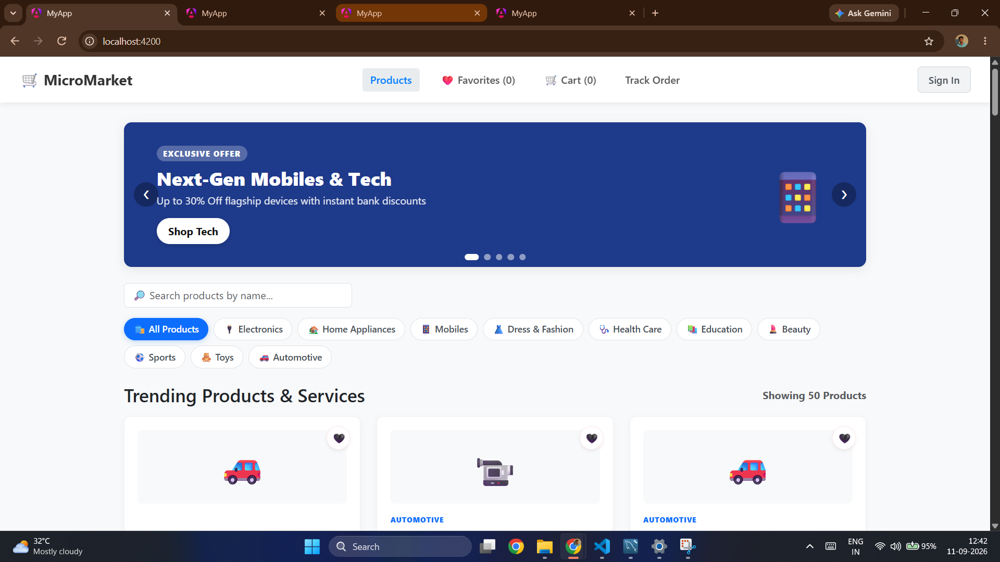
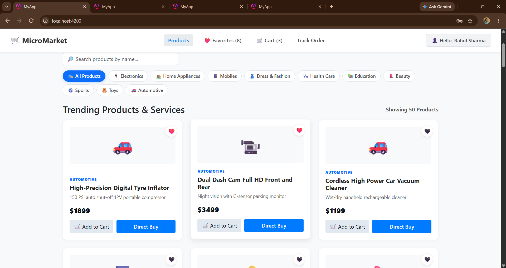
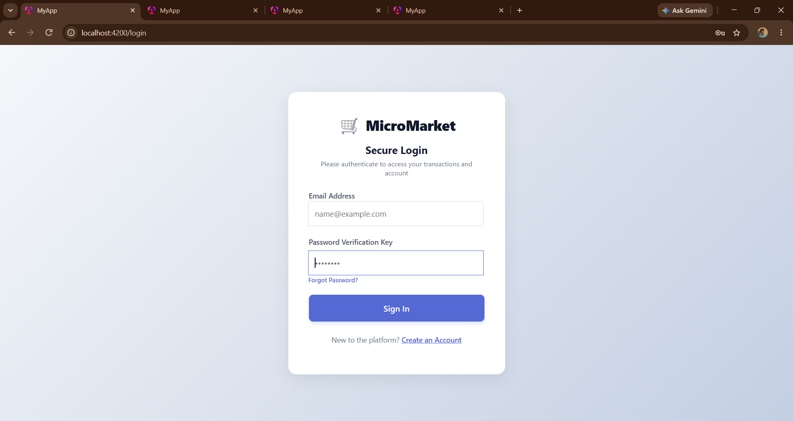
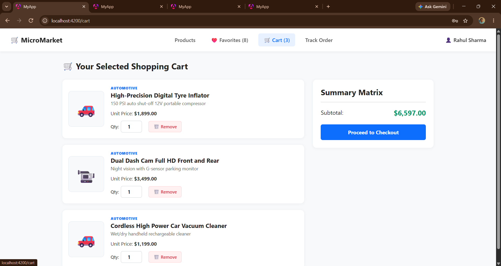
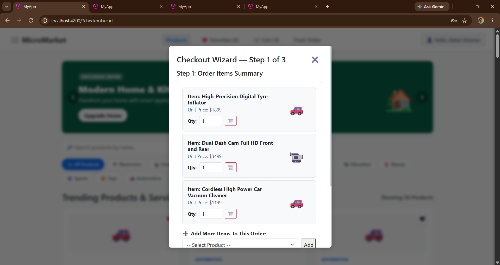
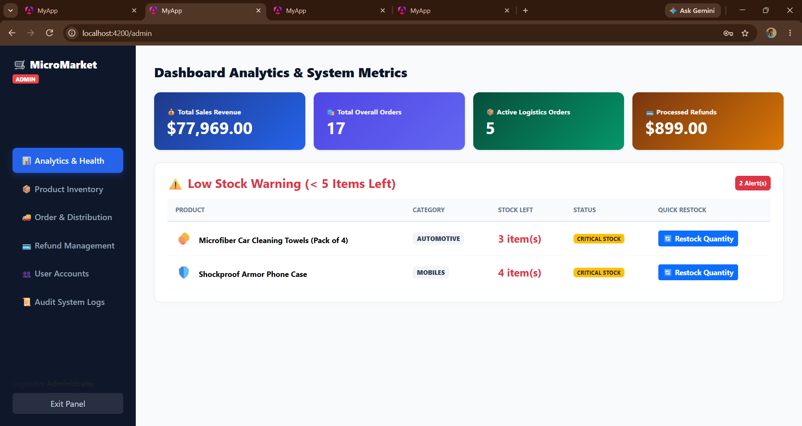

# 🛒 Full-Stack E-Commerce Platform

A scalable and responsive **Full-Stack E-Commerce Platform** built using **Angular, Spring Boot, Spring Cloud, Microservices, Eureka Service Discovery, API Gateway, and MySQL**.

The project is designed using a **microservices architecture**, where different business functionalities such as users, products, orders, administration, and distribution are handled by independent services.

---

## 📌 Project Overview

The **Full-Stack E-Commerce Platform** provides an online shopping experience where users can browse products, register and log in, manage their shopping activities, place orders, and track order-related information.

The backend is divided into multiple independent microservices to improve scalability, maintainability, and service-level separation.

### 🎯 Main Objectives

* Build a complete full-stack e-commerce application
* Implement a microservices-based backend
* Develop a responsive Angular frontend
* Create REST APIs using Spring Boot
* Implement service discovery using Eureka
* Use API Gateway for centralized backend routing
* Integrate MySQL databases
* Implement user, product, order, admin, and distribution management
* Gain practical experience with real-world full-stack development

---

# 🏗️ System Architecture

```text
                    ┌───────────────────────┐
                    │    Angular Frontend   │
                    │     Port: 4200        │
                    └───────────┬───────────┘
                                │
                                ▼
                    ┌───────────────────────┐
                    │      API Gateway      │
                    │      Port: 8080       │
                    └───────────┬───────────┘
                                │
             ┌──────────────────┼──────────────────┐
             │                  │                  │
             ▼                  ▼                  ▼
      ┌─────────────┐    ┌─────────────┐    ┌─────────────┐
      │ User Service│    │Product      │    │Order Service│
      │             │    │Service      │    │             │
      └──────┬──────┘    └──────┬──────┘    └──────┬──────┘
             │                  │                  │
             ▼                  ▼                  ▼
        ┌─────────┐        ┌─────────┐        ┌─────────┐
        │ MySQL   │        │ MySQL   │        │ MySQL   │
        └─────────┘        └─────────┘        └─────────┘

             ┌─────────────────────────────────────┐
             │          Other Services              │
             │                                     │
             │  Admin Service                      │
             │  Distribution Service               │
             └─────────────────────────────────────┘

                         ▲
                         │
                  ┌───────────────┐
                  │ Eureka Server │
                  │ Service       │
                  │ Discovery     │
                  └───────────────┘
```

---

# 🧩 Microservices

The project is divided into the following major modules:

### 1. 👤 User Service

Responsible for user-related operations.

**Responsibilities:**

* User registration
* User login
* User information management
* User database operations
* User-related REST APIs
* Eureka service registration

---

### 2. 📦 Product Service

Responsible for managing products in the e-commerce platform.

**Responsibilities:**

* Product management
* Product catalog
* Product information
* Product database operations
* Product-related REST APIs
* Service registration with Eureka

---

### 3. 🛒 Order Service

Responsible for order-related operations.

**Responsibilities:**

* Order creation
* Order management
* User order information
* Order processing
* Order database operations
* REST API integration

---

### 4. 👨‍💼 Admin Service

Responsible for administration-related operations.

**Responsibilities:**

* Administrative operations
* Product/order management support
* Admin-related APIs
* Backend administration functionality

---

### 5. 🚚 Distribution Service

Responsible for distribution and delivery-related functionality.

**Responsibilities:**

* Distribution management
* Delivery-related operations
* Order distribution workflow
* Delivery information handling

---

### 6. 🌐 API Gateway

The API Gateway acts as the central entry point between the Angular frontend and backend microservices.

```text
Angular
   │
   ▼
API Gateway
   │
   ├── User Service
   ├── Product Service
   ├── Order Service
   ├── Admin Service
   └── Distribution Service
```

**Benefits:**

* Centralized routing
* Simplified frontend communication
* Microservice endpoint management
* Single entry point for backend services

---

### 7. 🔎 Eureka Server

Eureka is used for **service discovery**.

Instead of hardcoding service locations, backend services register themselves with Eureka.

```text
                 Eureka Server
                      │
       ┌──────────────┼──────────────┐
       ▼              ▼              ▼
 User Service   Product Service   Order Service
       │              │              │
       └──────────────┼──────────────┘
                      │
              Service Discovery
```

This makes communication between microservices easier and supports a distributed architecture.

---

# 💻 Frontend

The frontend is developed using **Angular** and **TypeScript**.

The repository contains the Angular application inside:

```text
ecommerce-frontend/
```

### Frontend Technologies

* Angular
* TypeScript
* HTML5
* CSS3
* Angular CLI
* REST API integration
* Responsive UI

The frontend provides the user interface for browsing products and interacting with the e-commerce application.

---

# ⚙️ Backend

The backend is developed using **Java and Spring Boot**.

### Backend Technologies

* Java 21
* Spring Boot 3.2.5
* Spring Cloud
* Spring Data JPA
* REST APIs
* MySQL
* Maven
* Eureka Client

The repository configuration uses Spring Cloud `2023.0.1` and Java 21 for the Spring Boot services.

---

# 🗄️ Database

The application uses **MySQL** for persistent data storage.

Each major microservice can maintain its own database/schema, following the separation principle of microservice architecture.

### Database Responsibilities

| Service              | Database Responsibility     |
| -------------------- | --------------------------- |
| User Service         | User information            |
| Product Service      | Product information         |
| Order Service        | Order information           |
| Admin Service        | Administration-related data |
| Distribution Service | Distribution/delivery data  |

---

# ✨ Key Features

## 👤 User Features

* User registration
* User login
* User authentication
* User information management
* Product browsing
* Product selection
* Shopping workflow
* Order placement
* Order management

## 🛍️ Product Features

* Product catalog
* Product browsing
* Category-based filtering
* Product information
* Product management

## 🛒 Shopping Features

* Product selection
* Shopping cart
* Cart management
* Checkout workflow
* Order creation

## 📦 Order Features

* Order placement
* Order management
* User order information
* Order processing
* Distribution workflow

## 👨‍💼 Admin Features

* Administrative management
* Product management
* Order management
* Backend management operations

## 🚚 Distribution Features

* Distribution management
* Delivery-related operations
* Order distribution workflow

## 🔎 Microservices Features

* Eureka service discovery
* API Gateway
* REST API communication
* Independent backend services
* Database integration

---

# 🔄 Application Workflow

### Step 1 — User Opens Application

The user accesses the Angular application.

```text
Browser
   ↓
Angular Frontend
```

### Step 2 — Registration/Login

The user creates an account or logs in.

```text
Angular
   ↓
API Gateway
   ↓
User Service
   ↓
MySQL
```

### Step 3 — Browse Products

Products are retrieved from the Product Service.

```text
Angular
   ↓
API Gateway
   ↓
Product Service
   ↓
MySQL
```

### Step 4 — Shopping

The user selects products and manages the shopping cart.

### Step 5 — Checkout

The user proceeds through the checkout workflow.

### Step 6 — Order Creation

The order request is sent to the Order Service.

```text
Angular
   ↓
API Gateway
   ↓
Order Service
   ↓
MySQL
```

### Step 7 — Distribution

The order is processed through the Distribution Service for delivery-related operations.

### Step 8 — Service Discovery

Eureka maintains information about registered microservices and enables service discovery.

---

# 📁 Project Structure

```text
ECommerce/
│
├── admin-service/
│   ├── src/
│   ├── pom.xml
│   └── mvnw
│
├── api-gateway/
│   ├── src/
│   ├── pom.xml
│   └── mvnw
│
├── distribution-service/
│   ├── src/
│   ├── pom.xml
│   └── mvnw
│
├── ecommerce-frontend/
│   ├── public/
│   ├── src/
│   ├── angular.json
│   ├── package.json
│   └── tsconfig.json
│
├── eureka-server/
│   ├── src/
│   ├── pom.xml
│   └── mvnw
│
├── order-service/
│   ├── src/
│   ├── pom.xml
│   └── mvnw
│
├── product-service/
│   ├── src/
│   ├── pom.xml
│   └── mvnw
│
├── user-service/
│   ├── src/
│   ├── pom.xml
│   └── mvnw
│
└── README.md
```

The repository currently contains these eight main project folders/modules, including the Angular frontend and seven backend/infrastructure modules.

---

# 🛠️ Technologies Used

### Frontend

```text
Angular
TypeScript
HTML5
CSS3
Angular CLI
```

### Backend

```text
Java
Spring Boot
Spring Cloud
Spring Data JPA
REST APIs
```

### Microservices

```text
Spring Cloud
Eureka Service Discovery
API Gateway
```

### Database

```text
MySQL
```

### Build Tools

```text
Maven
npm
Angular CLI
```

### Version Control

```text
Git
GitHub
```

### Development Tools

```text
Visual Studio Code
IntelliJ IDEA / Eclipse
MySQL
MySQL Workbench
Postman
```

---

# 📋 Prerequisites

Before running the project, install:

* Java JDK 21
* Node.js
* npm
* Angular CLI
* MySQL
* Maven
* Git

Check installed versions:

```bash
java -version
node -v
npm -v
mvn -version
git --version
```

---

# 🚀 Installation & Setup

## 1. Clone the Repository

```bash
git clone https://github.com/BALAMURUGAN-4735/ECommerce.git
```

Move into the project:

```bash
cd ECommerce
```

---

# 🗄️ 2. Configure MySQL

Start MySQL and create the required databases according to the configuration files of each service.

Example:

```sql
CREATE DATABASE micro_user_db;
CREATE DATABASE micro_product_db;
CREATE DATABASE micro_order_db;
```

> Database names, usernames, passwords, and ports should match the `application.properties` / `application.yml` configuration of each service.

---

# 🔎 3. Start Eureka Server

Navigate to the Eureka Server:

```bash
cd eureka-server
```

Run:

```bash
mvn spring-boot:run
```

Or on Windows:

```bash
mvnw.cmd spring-boot:run
```

Eureka provides the service discovery mechanism for the microservices.

---

# 👤 4. Start User Service

```bash
cd user-service
mvn spring-boot:run
```

Windows:

```bash
mvnw.cmd spring-boot:run
```

---

# 📦 5. Start Product Service

```bash
cd product-service
mvn spring-boot:run
```

Windows:

```bash
mvnw.cmd spring-boot:run
```

---

# 🛒 6. Start Order Service

```bash
cd order-service
mvn spring-boot:run
```

Windows:

```bash
mvnw.cmd spring-boot:run
```

---

# 👨‍💼 7. Start Admin Service

```bash
cd admin-service
mvn spring-boot:run
```

---

# 🚚 8. Start Distribution Service

```bash
cd distribution-service
mvn spring-boot:run
```

---

# 🌐 9. Start API Gateway

```bash
cd api-gateway
mvn spring-boot:run
```

The API Gateway acts as the main backend entry point for the frontend.

---

# 💻 10. Start Angular Frontend

Navigate to:

```bash
cd ecommerce-frontend
```

Install dependencies:

```bash
npm install
```

Start the Angular development server:

```bash
ng serve
```

Then open:

```text
http://localhost:4200/
```

The frontend repository configuration confirms Angular CLI development through `ng serve`, with the application served at `localhost:4200`.

---

# 🔌 Service Communication

The general communication flow is:

```text
                 ┌─────────────────┐
                 │ Angular Client  │
                 └────────┬────────┘
                          │
                          ▼
                 ┌─────────────────┐
                 │  API Gateway    │
                 └────────┬────────┘
                          │
          ┌───────────────┼────────────────┐
          │               │                │
          ▼               ▼                ▼
    User Service    Product Service   Order Service
          │               │                │
          └───────────────┼────────────────┘
                          │
                          ▼
                    Eureka Server
                          │
                          ▼
                    Service Discovery
```

---

# 🔐 Security & Configuration

Sensitive configuration such as:

* Database passwords
* API credentials
* Production URLs
* Secret keys

should not be committed to GitHub.

Use environment variables or local configuration files for sensitive information.

Example:

```properties
spring.datasource.username=${DB_USERNAME}
spring.datasource.password=${DB_PASSWORD}
```

---

# 🧪 Testing

Backend services can be tested using tools such as:

* Postman
* Browser REST clients
* Angular frontend

Example REST API testing flow:

```text
Postman
   ↓
API Gateway
   ↓
Microservice
   ↓
MySQL
```

The Angular project also includes standard Angular build and test commands such as:

```bash
ng build
ng test
```

The frontend repository's existing Angular README documents these commands.

---

# 🏗️ Build the Frontend

To create a production build:

```bash
ng build
```

The generated build files are placed in the Angular `dist/` directory.

---

# 📊 Project Highlights

| Area                 | Implementation           |
| -------------------- | ------------------------ |
| Frontend             | Angular                  |
| Programming Language | Java, TypeScript         |
| Backend              | Spring Boot              |
| Architecture         | Microservices            |
| API                  | REST APIs                |
| Gateway              | Spring Cloud API Gateway |
| Discovery            | Eureka                   |
| Database             | MySQL                    |
| ORM                  | Spring Data JPA          |
| Build Tool           | Maven / npm              |
| Version Control      | Git & GitHub             |
| UI                   | Responsive Angular UI    |

---

# 🎓 Internship Project

This project was developed as part of my internship at:

**JD Software Pvt. Ltd**
📍 Kolapakkam, Chennai

### Project

**Full-Stack E-Commerce Platform**

### Learning Areas

Through this project, I gained practical experience in:

* Full-stack application development
* Angular development
* TypeScript
* Java
* Spring Boot
* Spring Cloud
* Microservices architecture
* REST API development
* API Gateway
* Eureka Service Discovery
* MySQL database integration
* JPA
* Maven
* Git and GitHub
* Debugging and testing
* Application deployment

---

# 💡 Key Learning Outcomes

This project helped me understand how a real-world application can be divided into independent services.

I gained practical knowledge of:

```text
Frontend Development
        ↓
REST API Integration
        ↓
Microservices
        ↓
Service Discovery
        ↓
API Gateway
        ↓
Database Integration
        ↓
Testing & Debugging
        ↓
Deployment
```

---

# 🔮 Future Enhancements

Possible future improvements include:

* JWT-based authentication
* Role-based authorization
* Online payment gateway
* Product reviews and ratings
* Wishlist
* Advanced search
* Email notifications
* Order tracking
* Docker containerization
* Docker Compose
* CI/CD pipeline
* Cloud deployment
* Centralized logging
* Monitoring and health checks
* Redis caching
* Improved security

---

# 📸 Screenshots

Add project screenshots here to make the GitHub repository more professional.

Example:

```markdown
## 🖥️ Application Screenshots

### Home Page


### Product Page


### Login Page


### Cart


### Checkout


### Admin Dashboard

```

Recommended folder:

```text
screenshots/
├── home.png
├── login.png
├── products.png
├── product-details.png
├── cart.png
├── checkout.png
├── orders.png
└── admin-dashboard.png
```

---

# 👨‍💻 Developer

**Balamurugan M**

Computer Science Engineering Student
Full-Stack Developer | Angular | Java | Spring Boot | Microservices

### GitHub

https://github.com/BALAMURUGAN-4735

### Project Repository

https://github.com/BALAMURUGAN-4735/ECommerce

---

# 🙏 Acknowledgement

I would like to sincerely thank **JD Software Pvt. Ltd, Kolapakkam, Chennai**, for providing me with the opportunity to work on this project and gain valuable practical experience in full-stack development and microservices architecture.

Special thanks to:

* **Mentor:** Rohith Kumar M
* **Manager:** Arun Balaji
* **HR Team:** Jaya prakash

for their guidance, support, and encouragement throughout the internship.

---

# ⭐ Conclusion

The **Full-Stack E-Commerce Platform** demonstrates the implementation of a modern web application using **Angular and Spring Boot Microservices**.

The project combines:

**Angular + Spring Boot + Microservices + REST APIs + API Gateway + Eureka + MySQL**

to create a scalable and maintainable e-commerce application.

This project provided valuable hands-on experience in designing, developing, integrating, testing, and deploying a real-world full-stack software system.

---

## 📜 License

This project was developed as an internship project for educational and professional learning purposes.

---

## ⭐ If you find this project useful

Consider giving the repository a ⭐ on GitHub.
