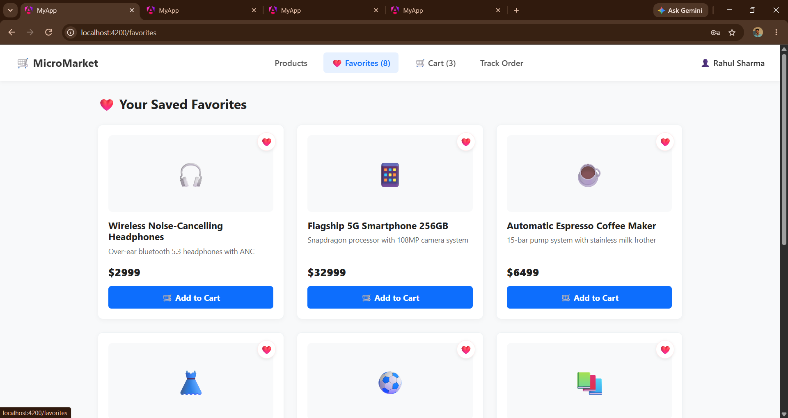
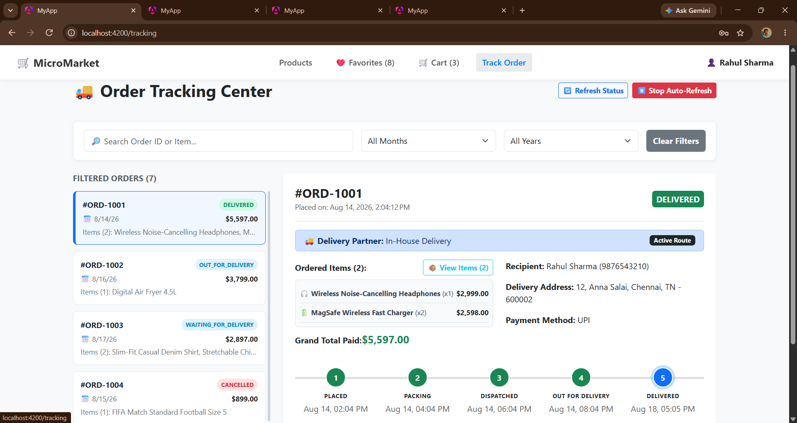
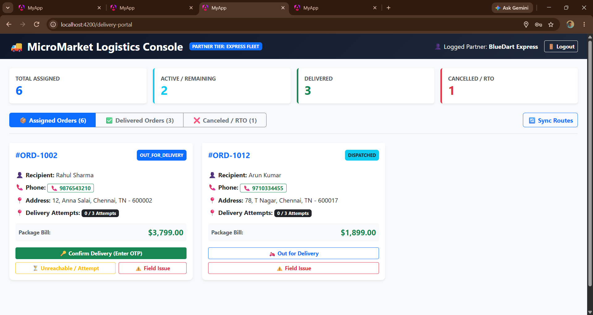

# 🛒 Full-Stack E-Commerce Platform

A modern **Full-Stack E-Commerce Platform** developed using **Angular, Spring Boot, Spring Cloud Microservices, MySQL, and REST APIs**.

This project was developed during my internship at **JD Software Pvt. Ltd., Kolapakkam, Chennai**, with a focus on building a scalable e-commerce application using a microservices-based architecture.

---

## 🚀 Project Overview

The Full-Stack E-Commerce Platform provides a complete online shopping experience where users can:

* Register and log in
* Browse products
* Filter products by category
* View product details
* Add products to favorites
* Add products to cart
* Proceed through checkout
* Place and manage orders
* Track order/delivery status

The platform also provides dedicated **Admin** and **Distribution** functionalities for managing products, users, orders, and deliveries.

---

## 🎯 Project Objectives

* Build a complete full-stack e-commerce application.
* Implement a scalable **microservices architecture**.
* Develop a responsive frontend using Angular.
* Develop backend services using Spring Boot.
* Implement RESTful APIs for frontend-backend communication.
* Use MySQL for persistent data storage.
* Implement API Gateway for centralized request routing.
* Implement Eureka Server for service discovery.
* Understand real-world software development and Git/GitHub workflow.

---

# 🏗️ System Architecture

```text
                         ┌──────────────────────┐
                         │   Angular Frontend   │
                         │      Port: 4200      │
                         └──────────┬───────────┘
                                    │
                                    ▼
                         ┌──────────────────────┐
                         │     API Gateway      │
                         │      Port: 8080      │
                         └──────────┬───────────┘
                                    │
              ┌─────────────────────┼─────────────────────┐
              │                     │                     │
              ▼                     ▼                     ▼
       ┌─────────────┐       ┌─────────────┐       ┌─────────────┐
       │ User Service│       │Product       │       │Order Service│
       │   :8085     │       │Service :8081 │       │   :8082     │
       └──────┬──────┘       └──────┬──────┘       └──────┬──────┘
              │                     │                     │
              ▼                     ▼                     ▼
       ┌─────────────┐       ┌─────────────┐       ┌─────────────┐
       │ MySQL       │       │ MySQL       │       │ MySQL       │
       │micro_user_db│       │micro_product│       │Order DB     │
       └─────────────┘       └─────────────┘       └─────────────┘

              ┌─────────────────────────────────────┐
              │         Eureka Server               │
              │       Service Discovery             │
              └─────────────────────────────────────┘

              ┌─────────────────────────────────────┐
              │ Admin Service / Distribution Service│
              └─────────────────────────────────────┘
```

---

# 🧩 Microservices

## 👤 User Service

Responsible for user-related operations.

### Responsibilities

* User registration
* User login
* User management
* User information
* Authentication-related operations
* User order information

**Port:** `8085`

**Database:** `micro_user_db`

---

## 📦 Product Service

Responsible for product catalog management.

### Responsibilities

* Add products
* Update products
* Delete products
* View products
* Product details
* Category management
* Product filtering

**Port:** `8081`

**Database:** `micro_product_db`

---

## 🛍️ Order Service

Responsible for order processing.

### Responsibilities

* Create orders
* Manage orders
* Retrieve user orders
* Order status management
* Checkout-related operations

**Port:** `8082`

---

## 👨‍💼 Admin Service

Provides administrative functionalities.

### Responsibilities

* Manage products
* Manage users
* Manage orders
* Monitor application operations
* Administrative dashboard

---

## 🚚 Distribution Service

Responsible for distribution and delivery-related operations.

### Responsibilities

* Delivery management
* Distribution workflow
* Delivery status
* Delivery dashboard

---

## 🌐 API Gateway

The API Gateway acts as the central entry point between the frontend and backend microservices.

**Port:** `8080`

### Responsibilities

* Request routing
* Centralized API access
* Microservice communication
* Frontend-backend integration

---

## 🔎 Eureka Service Discovery

Eureka is used for **service discovery** in the microservices architecture.

It allows backend services to discover and communicate with each other without depending on hard-coded service locations.

---

# 💻 Frontend

The frontend is developed using **Angular** and **TypeScript**.

### Main Pages

* Home
* Login
* Signup
* Product Catalog
* Product Details
* Favorites
* Cart
* Checkout
* Orders
* Delivery Dashboard
* Admin Dashboard

### Frontend Technologies

* Angular
* TypeScript
* HTML5
* CSS3
* Angular Routing
* REST API Integration
* Responsive Design

---

# ⚙️ Backend

The backend is developed using **Java and Spring Boot** with a microservices architecture.

### Backend Technologies

* Java
* Spring Boot
* Spring Cloud
* Spring Web
* Spring Data JPA
* REST APIs
* Eureka Client
* API Gateway
* Maven

---

# 🗄️ Database

The project uses **MySQL** for persistent data storage.

### Databases

```text
micro_user_db
micro_product_db
micro_order_db
```

Spring Data JPA is used for database interaction.

---

# ✨ Key Features

### 👤 User Features

* User registration
* User login
* Authentication
* Profile management
* Product browsing

### 🛒 Shopping Features

* Product catalog
* Category filtering
* Product details
* Add to cart
* Favorites
* Checkout
* Order placement

### 📦 Order Features

* Order creation
* Order history
* Order tracking
* Delivery status

### 👨‍💼 Admin Features

* Admin dashboard
* Product management
* User management
* Order management

### 🚚 Distribution Features

* Delivery dashboard
* Distribution management
* Delivery status updates

---

# 🔄 Application Workflow

```text
User
 │
 ▼
Angular Frontend
 │
 ▼
API Gateway
 │
 ├──► User Service
 │
 ├──► Product Service
 │
 ├──► Order Service
 │
 ├──► Admin Service
 │
 └──► Distribution Service
          │
          ▼
      MySQL Database
```

### Shopping Flow

```text
Register / Login
       ↓
Browse Products
       ↓
View Product Details
       ↓
Add to Cart / Favorites
       ↓
Checkout
       ↓
Place Order
       ↓
Order Processing
       ↓
Distribution
       ↓
Delivery
```

---

# 📁 Project Structure

```text
ECommerce/
│
├── admin-service/
│
├── api-gateway/
│
├── distribution-service/
│
├── ecommerce-frontend/
│
├── eureka-server/
│
├── order-service/
│
├── product-service/
│
├── user-service/
│
├── screenshots/
│   ├── home.png
│   ├── login.png
│   ├── products.png
│   ├── favorites.png
│   ├── cart.png
│   ├── checkout.png
│   ├── orders.png
│   ├── delivery-dashboard.png
│   └── admin-dashboard.png
│
└── README.md
```

---

# 🛠️ Technologies Used

| Category          | Technologies                     |
| ----------------- | -------------------------------- |
| Frontend          | Angular, TypeScript, HTML5, CSS3 |
| Backend           | Java, Spring Boot                |
| Architecture      | Microservices                    |
| API               | REST APIs                        |
| Service Discovery | Eureka                           |
| Gateway           | Spring Cloud Gateway             |
| Database          | MySQL                            |
| ORM               | Spring Data JPA                  |
| Build Tool        | Maven                            |
| Version Control   | Git, GitHub                      |
| Containerization  | Docker                           |

---

# 📋 Prerequisites

Make sure the following are installed:

* Java 21
* Node.js
* npm
* Angular CLI
* MySQL
* Maven
* Git
* IDE such as VS Code / IntelliJ IDEA / Eclipse

---

# ⚙️ Installation & Setup

## 1️⃣ Clone the Repository

```bash
git clone https://github.com/BALAMURUGAN-4735/ECommerce.git
```

```bash
cd ECommerce
```

---

# 🗄️ 2️⃣ Configure MySQL

Create the required databases:

```sql
CREATE DATABASE micro_user_db;
CREATE DATABASE micro_product_db;
CREATE DATABASE micro_order_db;
```

Update the MySQL username, password, and database configuration in the respective Spring Boot `application.properties` files.

---

# ▶️ 3️⃣ Start Eureka Server

Navigate to:

```bash
cd eureka-server
```

Run:

```bash
mvn spring-boot:run
```

---

# ▶️ 4️⃣ Start User Service

```bash
cd user-service
mvn spring-boot:run
```

User Service:

```text
http://localhost:8085
```

---

# ▶️ 5️⃣ Start Product Service

```bash
cd product-service
mvn spring-boot:run
```

Product Service:

```text
http://localhost:8081
```

---

# ▶️ 6️⃣ Start Order Service

```bash
cd order-service
mvn spring-boot:run
```

Order Service:

```text
http://localhost:8082
```

---

# ▶️ 7️⃣ Start Admin Service

```bash
cd admin-service
mvn spring-boot:run
```

---

# ▶️ 8️⃣ Start Distribution Service

```bash
cd distribution-service
mvn spring-boot:run
```

---

# ▶️ 9️⃣ Start API Gateway

```bash
cd api-gateway
mvn spring-boot:run
```

API Gateway:

```text
http://localhost:8080
```

---

# ▶️ 🔟 Start Angular Frontend

Navigate to:

```bash
cd ecommerce-frontend
```

Install dependencies:

```bash
npm install
```

Start Angular:

```bash
ng serve
```

Open:

```text
http://localhost:4200
```

---

# 🔗 Service Communication

```text
Angular
   │
   ▼
API Gateway
   │
   ├── User Service
   ├── Product Service
   ├── Order Service
   ├── Admin Service
   └── Distribution Service
             │
             ▼
        MySQL Databases
```

Eureka Service Discovery helps the microservices locate and communicate with each other.

---

# 🔐 Security & Configuration

The application separates frontend and backend responsibilities and uses service-level configuration for:

* Database connection
* Service ports
* Eureka registration
* API Gateway routing
* REST API communication

Sensitive credentials such as database passwords should be stored securely and should **not** be committed to GitHub.

---

# 🧪 Testing & Build

Build individual Spring Boot services using:

```bash
mvn clean install
```

Run tests using:

```bash
mvn test
```

Build the Angular application:

```bash
ng build
```

---

# 📸 Application Screenshots

## 🏠 Home Page


## 🔐 Login Page


## 🛍️ Product Catalog


## ❤️ Favorites



## 🛒 Shopping Cart


## 💳 Checkout


## 📦 Orders



## 🚚 Delivery Dashboard



## 👨‍💼 Admin Dashboard


---

# 📊 Project Highlights

| Feature           | Implementation  |
| ----------------- | --------------- |
| Frontend          | Angular         |
| Backend           | Spring Boot     |
| Architecture      | Microservices   |
| API Communication | REST APIs       |
| Service Discovery | Eureka          |
| API Routing       | API Gateway     |
| Database          | MySQL           |
| ORM               | Spring Data JPA |
| Build             | Maven           |
| Version Control   | Git & GitHub    |

---

# 🎓 Internship Project

This project was developed as part of my internship at:

### **JD Software Pvt. Ltd.**

📍 Kolapakkam, Chennai

### Internship Focus

**Full-Stack Web Development & Microservices**

During the internship, I worked on frontend development, backend microservices, REST API integration, database connectivity, service discovery, API Gateway configuration, testing, debugging, and Git/GitHub version control.

---

# 👨‍💻 My Contributions

* Developed Angular frontend modules.
* Created and integrated Spring Boot microservices.
* Implemented REST API communication.
* Integrated Angular with backend APIs.
* Configured MySQL database connectivity.
* Implemented Spring Data JPA.
* Worked with Eureka Service Discovery.
* Configured API Gateway.
* Developed e-commerce workflows.
* Worked on admin and distribution modules.
* Tested and debugged application issues.
* Managed source code using Git and GitHub.

---

# 📚 Learning Outcomes

Through this project, I gained practical experience in:

* Angular
* TypeScript
* Java
* Spring Boot
* Spring Cloud
* Microservices Architecture
* REST API Development
* Spring Data JPA
* MySQL
* API Gateway
* Eureka Service Discovery
* Maven
* Git & GitHub
* Full-Stack Application Development
* Debugging and Testing

---

# 🔮 Future Enhancements

Possible future improvements include:

* Online payment gateway integration
* JWT-based authentication
* Advanced product search
* Product reviews and ratings
* Email notifications
* Real-time order tracking
* Docker-based deployment
* Cloud deployment
* Redis caching
* CI/CD pipeline
* Advanced analytics dashboard

---

# 👤 Developer

### **Balamurugan M**

**Computer Science Engineering Student | Full-Stack Developer**

GitHub:
https://github.com/BALAMURUGAN-4735

Project Repository:
https://github.com/BALAMURUGAN-4735/ECommerce

---

# 🙏 Acknowledgement

I would like to express my sincere gratitude to **JD Software Pvt. Ltd., Kolapakkam, Chennai**, for providing me with the opportunity to work on this project and gain valuable practical experience.

Special thanks to:

* **Mentor:** Rohith Kumar M
* **Manager:** Arun Balaji
* **HR Team:** Jaya prakash

Their guidance and support helped me improve my technical knowledge and understand real-world software development practices.

---

# 🏁 Conclusion

The **Full-Stack E-Commerce Platform** provided valuable hands-on experience in developing a real-world application using modern frontend, backend, database, and microservices technologies.

The project helped me understand how independent services communicate through REST APIs, how service discovery and API Gateway work together, and how a complete e-commerce workflow can be implemented using a scalable architecture.

---

## ⭐ Support

If you find this project useful or interesting, consider giving the repository a ⭐ on GitHub.

**Thank you for visiting this project!**
